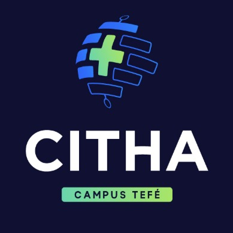

# Landing Page – Projeto CITHA



Esta é a landing page oficial do projeto **Capacitação e Interiorização de Tecnologias Habilitadoras na Amazônia – CITHA**. Desenvolvida com [Next.js](https://nextjs.org/), a página tem como objetivo divulgar os cursos gratuitos de tecnologias habilitadoras e facilitar o processo de inscrição para a comunidade.

## 📚 Sobre o Projeto

O projeto CITHA é uma iniciativa do **Instituto Federal de Educação, Ciência e Tecnologia do Amazonas – IFAM**, em parceria com a **FAEPI** e a **SEDECTI**, que visa oferecer cursos gratuitos de capacitação nas áreas de:

- **Aprendizado de Máquina**
- **Redes Neurais**
- **Visão Computacional**

Os cursos são voltados à população de Tefé-AM e região, com o intuito de promover inclusão digital e tecnológica na Amazônia.

## 🚀 Funcionalidades

- Seção informativa sobre os cursos ofertados
- Botões para inscrição via formulário Google Forms
- Detalhamento de datas, status e local das aulas
- Layout responsivo com design moderno
- Informações de contato e parceiros do projeto

## 🛠️ Tecnologias Utilizadas

- [Next.js](https://nextjs.org/)
- [React](https://react.dev/)
- [Tailwind CSS](https://tailwindcss.com/)
- [Lucide Icons](https://lucide.dev/)
- [ShadCN UI](https://ui.shadcn.com/)

## 📦 Instalação

Para rodar o projeto localmente:

```bash
# Clone este repositório
git clone https://github.com/FelipeHuffner-Developer/citha-landing-page.git

# Acesse a pasta do projeto
cd citha-landing-page

# Instale as dependências
npm install

# Rode o servidor de desenvolvimento
npm run dev
```

Abra `http://localhost:3000` no navegador para visualizar a página.

## 📁 Estrutura

```bash
.
├── pages/
│   └── index.tsx            # Página principal
├── public/images/           # Logos e imagens do projeto
├── components/ui/           # Componentes de UI reutilizáveis
├── styles/                  # Estilização geral
└── README.md
```

## 📍 Local das Aulas

> **Laboratório de Robótica - SEDECTI**  
> Rua Campinas, 26 – Santa Teresa, Tefé-AM

## 📱 Contato

- [Instagram do IFAM Tefé](https://www.instagram.com/ifamcampustefe/)
- WhatsApp: [Clique aqui para conversar](https://wa.me/5597981283734)

## 🤝 Parceiros

- **IFAM** - Instituto Federal do Amazonas  
- **FAEPI** - Fundação de Apoio ao IFAM  
- **SEDECTI** - Secretaria de Desenvolvimento de Tefé

## 📄 Licença

Este projeto está licenciado sob a licença MIT.
# citha-landing-page
